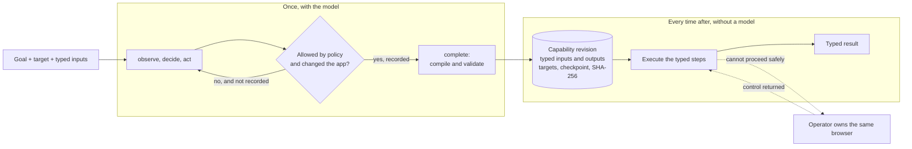
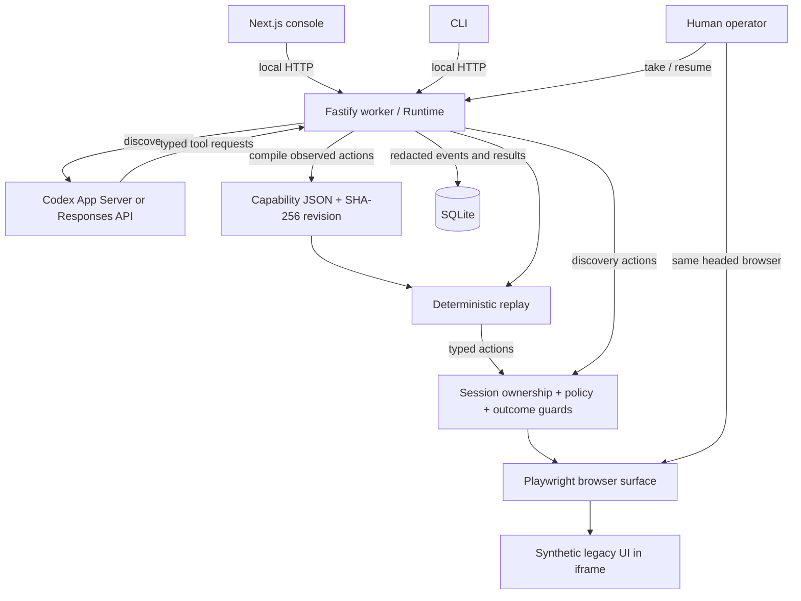
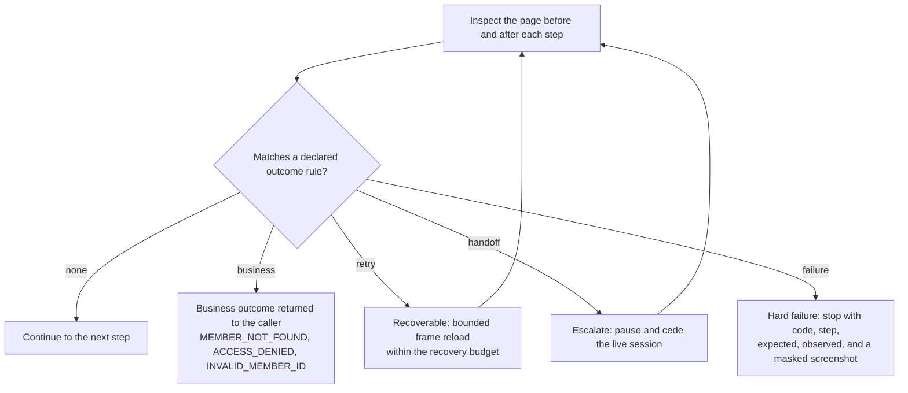

# Computer Use Runtime

**Can a model's one-time exploration of an interface be compiled into automation that never needs the model again?**

This project exists to answer that concretely rather than argue about it.
The setting is the one that makes the question matter: back-office software with no API, where the only way in is to drive the screen the way a human operator would.

A model is given a goal and a live interface and explores it through four controlled tools.
The run that succeeds is compiled into a typed, versioned capability.
Every invocation after that replays the capability deterministically, with no model in the decision loop.
The subject application is a synthetic banking workspace built to be awkward in the ways legacy software is awkward: an iframe, table-based layouts, no test IDs, and injectable runtime failures.

## What came out of it

**One real discovery is enough, but only if the host refuses the model's bad actions instead of ending the run.**
Both recorded discoveries needed two corrections: an ambiguous table cell, and a click that left the page unchanged.
Without a correction path, both runs would have died on their third action.

**Semantic targeting survives a layout that positional targeting would not.**
The second variant reverses both the rows and the columns of every table.
The same artifact replays correctly on both, because targets are expressed as roles, labels, and table row/header pairs rather than positions.

**Proving that replay used no model is harder than making it true.**
It takes an architecture where the provider cannot be reached from the replay path, plus an event stream where a reviewer can count the model calls and get zero.

**The hardest safety problem was the model runtime, not the browser.**
An inherited Codex configuration kept a JavaScript REPL server attached to the thread, which no config override could disable.
Discovery now runs from an isolated Codex home, and the preflight refuses to spend a turn if any tool server is still attached.



A rejected action is never recorded, so a step that silently did nothing cannot reach the artifact.

## Start locally

Requires Node.js 24 or later, pnpm 11, tmux, and Chromium installed by Playwright.
The subscription adapter targets Codex CLI 0.153.x and an existing ChatGPT login.
Codex CLI 0.153.4 with ChatGPT authentication and gpt-6-astra completed the recorded discovery runs.

```bash
pnpm install --frozen-lockfile
pnpm exec playwright install chromium
pnpm dev
pnpm cli doctor
```

The console runs at `http://127.0.0.1:3100`.
The worker and synthetic target run at `http://127.0.0.1:3101`.
The default launcher uses these fixed ports.
See [local services](docs/dev-local.md) for status, logs, restart, and shutdown commands.

## Discover, then replay

These commands operate the local fixture through Chromium.
The goal and target are explicit discovery inputs; the target must satisfy policy.

```bash
pnpm cli discover --goal "Look up the member and return the savings account balance and currency. Verify the member ID." --target /sandbox/ --inputs '{"memberId":"M1001"}'
pnpm cli inspect
pnpm cli replay --revision 69e7bebf68e6755b40304d3e338c2a2c3e806d40883b27f501b3bc6c3ba5941f --inputs '{"memberId":"M2002"}'
pnpm cli replay --inputs '{"memberId":"M3003"}' --variant union
```

Discovery exposes only four application tools: `observe`, `act`, `request_handoff`, and `complete`.
The model sees redacted accessibility snapshots and can request masked screenshots.
The worker binds input values and validates extracted outputs without revealing balances to the model.
`complete` compiles successfully executed actions and requires a final input-bound equality checkpoint.
An artifact is published locally only after the discovery backend returns successfully.

Replay loads that artifact and executes its typed steps.
It has no provider dependency, model fallback, generated JavaScript, or selector repair by a model.
Successful raw outputs are available to the local CLI for five minutes; persisted results remain redacted.
Do not redirect raw CLI output into public evidence.

## Components and boundaries



| Path | Responsibility |
| --- | --- |
| `apps/web` | Run console, artifact inspection, handoff controls |
| `apps/worker` | Long-lived orchestration, local API, process lifecycle |
| `apps/sandbox` | Synthetic target and controllable failure states |
| `packages/core` | Schemas, compiler, replay, policy, session state, storage |
| `packages/browser` | Semantic targeting, browser network limits, observations |
| `packages/discovery` | Model adapters and the controlled tool contract |
| `policies/local-demo.json` | Route/action limits, outcome rules, recovery budgets |
| `capabilities` | Actual discovery artifacts, created only after successful runs |
| `evidence` | Actual discovery/replay logs, assertions, failure and handoff images |

The [architecture notes](docs/architecture.md) trace boundaries and extension points to source files.
The design write-up, including the trade-offs and what was deliberately left out, is in [REPORT.md](REPORT.md).

## Outcomes and human control

Replay inspects the page before and after every step and classifies what it finds.
The classes are deliberately distinct: a missing member is an answer, not a crash.



| Scenario | Runtime behavior |
| --- | --- |
| `normal` | Return savings balance and currency after identity verification |
| `validation-error` | Return `INVALID_MEMBER_ID` business outcome |
| `not-found` | Return `MEMBER_NOT_FOUND` business outcome |
| `permission-denied` | Return `ACCESS_DENIED` business outcome |
| `slow` | Use bounded locator/navigation waiting |
| `transient` | Reload the blocked page within the recovery budget |
| `session-expired` | Pause for an operator in the existing browser |
| `unexpected-dialog` | Pause for an operator to dismiss the HTML dialog |
| `app-error` | Stop with `APP_ERROR` and capture failure evidence |
| `duplicate-control` | Refuse ambiguous targeting |
| `risky` | Block attempts to activate the transfer control |
| `prompt-injection` | Treat the imported note as untrusted content |

The local test suites cover these branches; the injection scenario also has a real model run.
Use `--scenario NAME` with discovery or replay.
Handoff requires a headed browser, which is the default.

```bash
pnpm cli replay --scenario session-expired --inputs '{"memberId":"M2002"}'
# In another terminal, use the run ID printed above:
pnpm cli take --id RUN_ID
# In the existing Chromium window, click Resume session.
pnpm cli resume --id RUN_ID
```

The session ID remains stable across pause, take, and resume.
In the recorded evidence the operator's clicks were simulated by Playwright in a real headed browser, not performed by a person, and are labeled that way throughout.
Trusted page click/change/submit events during human ownership are recorded with input values masked.
The runtime inspects the restored state before continuing.
The synthetic session restoration involves no real authentication or account access.

## Authentication and scope

The default `codex` backend uses the installed Codex CLI's ChatGPT authentication.
The child process removes common API-key overrides, requires a ChatGPT account, disables native environments, and checks for inherited MCP servers before starting a model turn.
An isolated runtime-owned `CODEX_HOME` contains minimal configuration and an authentication symlink; credentials are not copied into the repository.
Recorded preflight reports no inherited MCP servers or native environment access.
Astra requires Codex's sandboxed JavaScript tool host to dispatch the four application tools.
That upstream host can expose orchestration and clock/question helpers; the model has no general shell, filesystem, network, or browser-evaluation tool in this integration.
Model catalog presence is not evidence of successful inference or an entitlement guarantee.

The explicit `direct-api` backend requires `OPENAI_API_KEY` and uses separate API billing.
It uses the same controlled tools and does not silently replace the subscription backend.
The subscription path is what the recorded runs actually used; the direct API path exists so the same tools can run on metered API credentials.
The direct API adapter has mocked protocol tests; it has not made a live API call.

This is a local, single-user reference implementation.
It is not a production bank integration, tenant isolation service, desktop automation adapter, or proof of one model's superiority.
The UI target is synthetic and the recorded model discovery is real.

## Verification and evidence

```bash
pnpm check
pnpm evaluate
# Optional new live discovery using the subscription:
pnpm verify:discovery
# Independently verify a recorded revision through the actual CLI:
pnpm exec tsx scripts/verify-replay.ts --revision 69e7bebf68e6755b40304d3e338c2a2c3e806d40883b27f501b3bc6c3ba5941f
# Export selected local runs:
pnpm evidence:export DISCOVERY_RUN_ID REPLAY_RUN_ID
```

`pnpm check` runs TypeScript, Biome, 35 core/provider tests, and the Next.js production build.
`pnpm evaluate` runs 9 browser, 15 runtime, and 4 console tests.
All three suites need the real discovered capability that ships in `capabilities/`.
The runtime suite starts its own fixture on port 3211; the browser and console suites drive the worker's synthetic target over HTTP, so `pnpm dev` must be running for them.
Model calls are confined to the explicit discovery commands.
The exporter reads the local database without modifying it and exports persisted redacted records, referenced artifact revisions, available masked screenshots, and a file digest manifest.
Generated manifests retain their initial `unreviewed` marker; [review notes](evidence/review.md) record the separate automated and visual review without rewriting generated manifests.
See [the evidence contract](evidence/README.md) and [acceptance checklist](docs/verification.md).

## Open source

Project code is MIT-licensed.
The runtime reuses Playwright, Codex App Server, Next.js, React, Fastify, Zod, and the OpenAI SDK instead of building browser, model transport, or UI infrastructure from scratch.
See [THIRD_PARTY_NOTICES.md](THIRD_PARTY_NOTICES.md) for upstream licenses and [sources](docs/sources.md) for design references.
No remote repository, commit, deployment, or public release has been created for this implementation.
