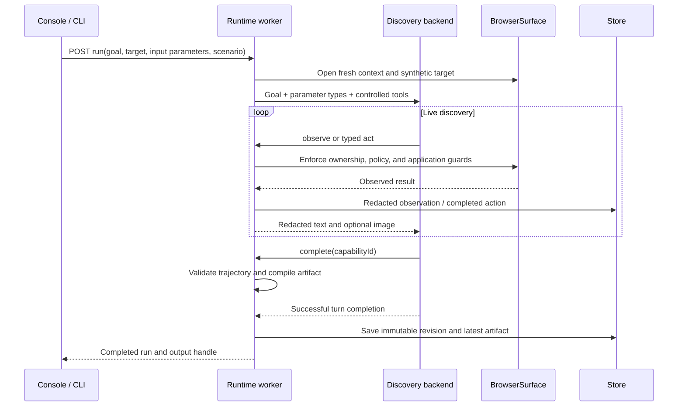
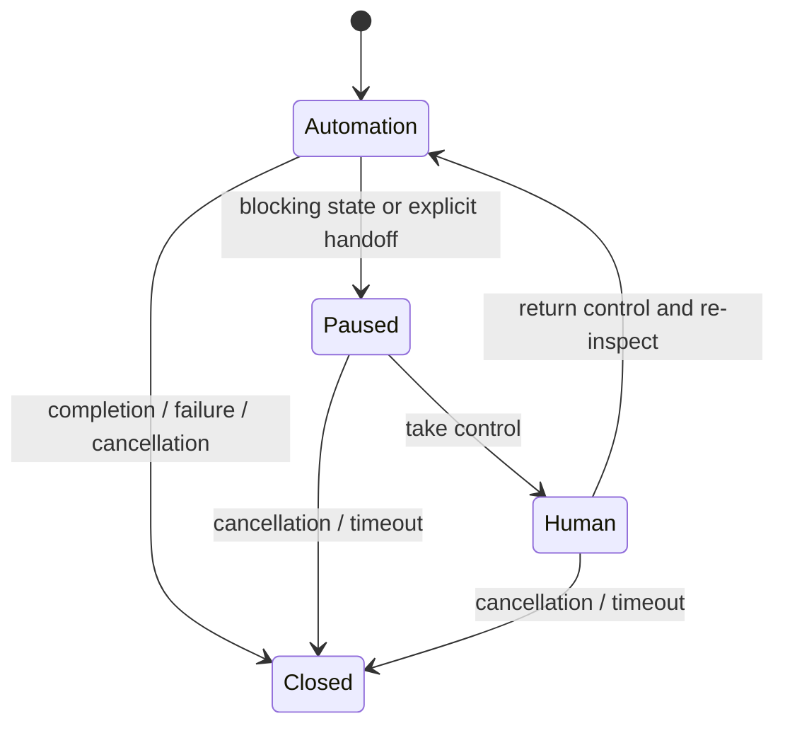

# Architecture and contracts

The worker owns browser lifetime; a Next.js request never owns it.
The model selects actions only during discovery.
The replay module imports core contracts and validation without importing either provider.

## Discovery and recording



`apps/worker/runtime.ts` is the composition root.
It selects the backend, handles outcomes, routes actions through ownership checks, and saves results.
`packages/discovery/backend.ts` defines provider-neutral tools.
`packages/discovery/codex-app-server.ts` implements JSON-RPC over the CLI's stdio transport.
`packages/discovery/direct-api.ts` implements a bounded Responses API tool loop.
Neither provider reads the fixture source or fixture data through its tool interface.
Real runs recorded ChatGPT authentication, gpt-6-astra, no native environments, and zero inherited MCP servers.
The adapter uses an isolated `CODEX_HOME` with an authentication symlink and enables Codex's sandboxed orchestration host because this Astra runtime requires it.
The four registered application tools are separate from upstream execution/wait and clock/question helpers.
No application tool offers arbitrary browser evaluation, filesystem access, shell execution, or unrestricted network access.

## Capability identity

`packages/core/contracts.ts` is the schema source of truth.
`schemaVersion: 1` versions the envelope; `version: 1.0.0` identifies the current capability contract format.
The SHA-256 digest identifies an exact recorded revision, including provenance.
`capabilities/revisions/<digest>.json` retains the immutable content.
`capabilities/<id>.json` selects the latest recorded revision for that capability ID.
Each replay emits the selected digest, so a later discovery cannot change its exported evidence.
The run-specific capability endpoint and console inspector load that recorded revision instead of the latest pointer.
Concurrent discoveries with the same ID are last-published-wins for the latest pointer.

Steps are `navigate`, `click`, `fill`, `select`, `scroll`, `read`, or `checkpoint`.
Values use an invocation reference or a literal.
Targets use exact accessible roles/names, labels, text, or a table row label and column header, optionally scoped by an iframe title.
The following is an illustrative schema fragment, not a discovered artifact:

```json
{
  "type": "checkpoint",
  "target": {
    "by": "tableCell",
    "row": "Member ID",
    "column": "Value",
    "frame": "Member workspace"
  },
  "expect": "equals",
  "value": { "input": "memberId" },
  "reason": "Verify that the displayed member matches the invocation."
}
```

The compiler rejects an unparameterized input, missing read, or final checkpoint without input-bound equality.
Replay rejects a changed digest or input type mismatch and validates declared output types.
The digest detects modification relative to the recorded value; it is not a signature or an authorization mechanism.

## Browser and policy boundaries

`packages/browser/playwright.ts` resolves semantic targets and refuses ambiguous matches.
The `union` fixture reverses table columns and rows; the selector algorithm resolves labels rather than persisted column numbers.
This is one application family with layout variation, not demonstrated cross-product generalization.
Arbitrary browser evaluation is absent from the model tool contract.
The adapter uses its own trusted code for observations and event capture.

Every automated action is checked against policy and current ownership.
During discovery, a click is followed by a bounded wait for a changed frame URL or accessibility snapshot.
Cancellation and policy failures terminate that wait; it never re-executes the action.
No observed change before the deadline produces uncertain-effect feedback, while the final checkpoint remains the success criterion.
Browser requests are restricted to the configured local origin and `/sandbox/` path prefix.
Popups are closed, downloads are disabled, service workers are blocked, and credential fields are rejected.
Exact click names must be allowed, and blocked control names take precedence.
These controls are sufficient in scope only for the synthetic application contract; an allowed click name does not establish read-only semantics in an arbitrary application.

Business/recovery markers match visible heading names exactly.
Transient recovery reloads the current frame at most the configured number of times.
No retry replays an arbitrary prior click.
Native JavaScript dialogs are dismissed and terminate the run for review; HTML dialogs use human handoff.

## Session ownership



`packages/core/session.ts` enforces transitions.
The pending automation promise waits while the browser context remains open.
The operator uses the existing headed Chromium window, not a new session or a public debugging endpoint.
Automation resumes only after the human owner returns control.
Trusted page interaction capture records coarse actions, not a complete desktop audit or keystroke replay.
Human actions are not silently compiled into automation steps.
Worker restart fails unfinished persisted runs; it does not claim to restore a lost browser session.

## Persistence and extension seams

SQLite stores run metadata and redacted events.
Masked failure/intervention images live under ignored `.local/runs`.
Raw success outputs stay in worker memory for five minutes and are cleared on expiry or shutdown.
The local API's origin check and custom client header reduce browser cross-origin access; they are not user authentication.

A production multi-tenant version needs an authenticated tenant principal, per-tenant storage and key boundaries, a scheduler, browser/process isolation, scoped credentials, and artifact promotion rules.
None of those is represented by a fictitious `tenantId` field here.
The current two-session limit is a local capacity bound.

A reusable tenant binding would contain a vendor family/version, approved base capability hash, tenant origin, tenant policy, and independently versioned selector overrides.
An application fingerprint check would reject incompatible versions before replay; checkpoint drift would stop execution and require reviewed rediscovery or an approved override.
This binding registry, fingerprint mechanism, and promotion workflow are design proposals, not current code.
The implemented immutable artifact and policy interfaces are the starting seams.

Additional web applications need an application descriptor, outcome rules, and task-specific completion requirements.
The current demo hardcodes the entry frame and goal-specific instructions at those boundaries.
Native desktop or terminal targets need a separate surface implementation and matching targeting schema; Playwright alone does not provide those surfaces.
